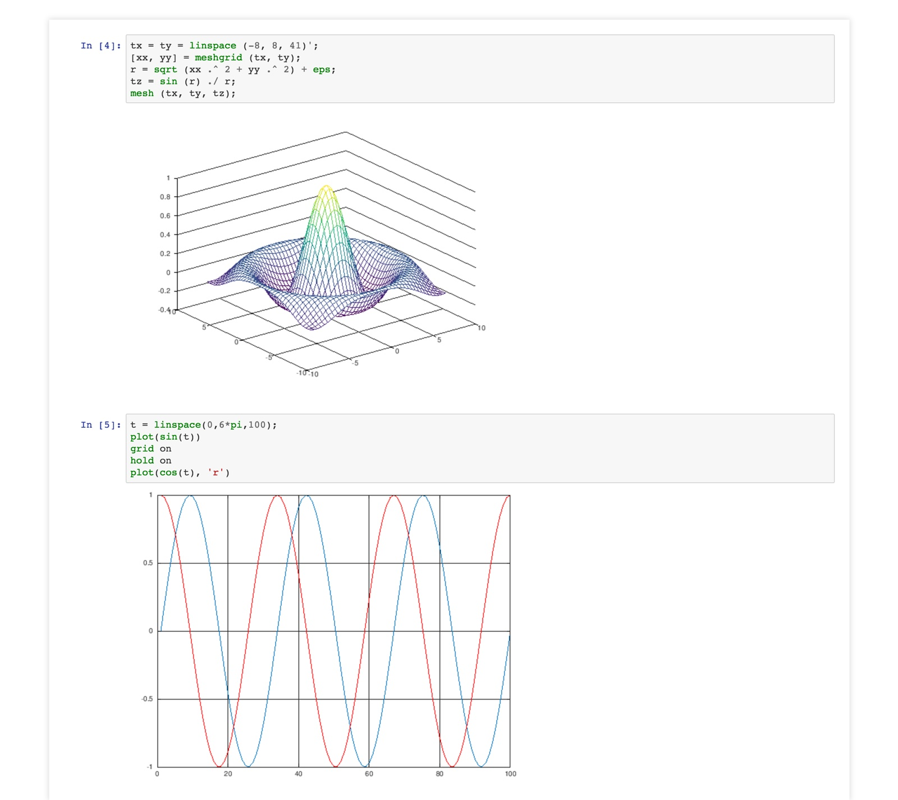

# Docker for Jupyter and Octave

This is docker image for Python3, Jupyter and Octave, based on alpine linux



### Run

You can run the command below:

```bash
docker run -d --name jupyter -p 8888:8888 -v YOU_VOL_FOLDER:/opt playniuniu/jupyter-octave
```

and visit [http://localhost:8888](http://localhost:8888) for jupyter notebook

### Plot

You can use the command in jupyter to plot octave images

```octave
tx = ty = linspace (-8, 8, 41)';
[xx, yy] = meshgrid (tx, ty);
r = sqrt (xx .^ 2 + yy .^ 2) + eps;
tz = sin (r) ./ r;
mesh (tx, ty, tz);
```

For more details, you can check the online [demo](http://nbviewer.jupyter.org/github/Calysto/octave_kernel/blob/master/octave_kernel.ipynb)
